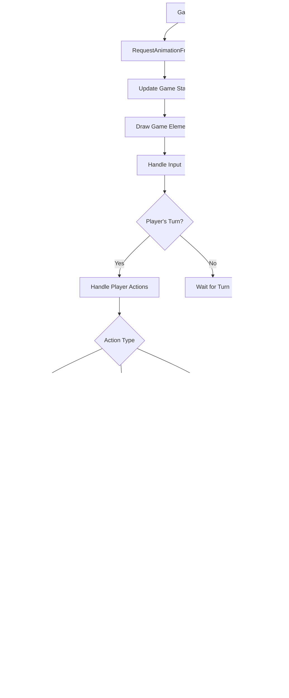

# Game Flow

## Project Overview
- A real-time multiplayer physics-based game
- Players take turns launching pucks to score points
- Target audience: Casual gamers looking for quick, strategic matches
- Key features:
  - Real-time multiplayer gameplay
  - Physics-based interactions
  - Multiple game modes
  - Territory control mechanics
- Supported platforms: Modern web browsers (Chrome, Firefox, Safari, Edge)

## Technical Stack
- Node.js backend
- Express.js web server
- HTML5 Canvas for rendering
- Vanilla JavaScript for game logic
- CSS3 for styling

## File Structure
- .git (directory)
- .gitignore
- GAMEFLOW.md
- config.js
- gameplan.md
- node_modules (directory)
- package-lock.json
- package.json
- progress.md
- public (directory)
  - css (directory)
  - index.html
  - js (directory)
    - config.js
    - game.js
    - lobby.js
    - socket-client.js
  - styles (directory)
- render.yaml
- server.js
- styles (directory)
  - main.css

## Game Mechanics
- Game Modes:
  - Classic: Score points through puck collisions
  - Territory: Control grid cells with puck placement
- Scoring System:
  - Collision-based scoring in Classic mode
  - Territory control percentage in Territory mode
- Turn-based gameplay with alternating moves
- Physics-based collisions and momentum transfer
- Power calculation based on charge time
- Valid placement restrictions within player territory

## API Documentation
### WebSocket Events
- Client to Server:
  - createRoom: Create a new game room
  - joinRoom: Join existing room by ID
  - gameMove: Send player moves
  - launchPuck: Launch puck with velocity
- Server to Client:
  - roomCreated: Room creation confirmation
  - roomJoined: Room join confirmation
  - gameUpdate: Game state updates
  - errorMessage: Error notifications

## State Management
### Game State
- Room ID
- Connected players
- Current turn
- Puck positions and velocities
- Scores
- Game mode
- Territory grid state (if applicable)

### Player State
- Player number (1 or 2)
- Score
- Connection status
- Territory control (in Territory mode)

## UI/UX Components
- Canvas Elements:
  - Game board
  - Pucks
  - Territory grid
  - Score display
  - Turn indicator
  - Power meter
  - Visual effects (sparks, score popups)
- Sound Effects:
  - Collision sounds
  - Launch sounds
  - Score sounds
  - Victory/defeat sounds

## Game Flow Diagrams

### Game Initialization Flow

### Game Loop Flow

### Collision and Scoring Flow

### Territory Control Flow

### Error Handling Flow

## Function Descriptions

### config.js (root directory)
- Exports a configuration object with settings for production and development environments.

### public/js/config.js
- Defines various configuration constants for the game, such as canvas dimensions, puck properties, physics parameters, UI settings, sound file names, game modes, territory grid properties, and server URL.

### server.js
- `app.use((req, res, next) => { ... })`: Middleware to enable CORS for all routes.
- `app.get('/health', (req, res) => { ... })`: Health check endpoint.
- `app.use(express.static(path.join(__dirname, 'public')))`: Serves static files from the "public" folder.
- `app.get('/', (req, res) => { ... })`: Basic route to serve index.html.
- `io.on('connection', (socket) => { ... })`: Handles WebSocket connections.
  - `socket.on('createRoom', (data) => { ... })`: Creates a new game room.
  - `socket.on('joinRoom', (roomId) => { ... })`: Joins an existing game room.
  - `socket.on('gameMove', (data) => { ... })`: Handles game moves (reset, launch, collision).
  - `socket.on('launchPuck', (data) => { ... })`: Handles puck launches.
  - `socket.on('disconnect', () => { ... })`: Handles client disconnects and cleans up rooms.
- `generateRoomId(length = 6)`: Utility function to generate a unique room ID.

### public/js/lobby.js
- `socket = io(CONFIG.SERVER.URL, { ... })`: Initializes the Socket.IO client and handles connection events.
- `enableButtons(enabled)`: Enables or disables the lobby buttons based on the connection status.
- Event listeners for lobby buttons and mode selection.
- Socket event handlers for `roomCreated`, `roomJoined`, `startGame`, and `errorMessage`.
- `showRulesIfNeeded()`: Shows the rules overlay if the user hasn't seen them before.

### public/js/game.js
- `Game class`:
  - `constructor(playerNumber, socket, roomId, gameMode)`: Initializes the game, sets up the canvas, event listeners, and socket connection.
  - `init(gameMode)`: Initializes the game state, including pucks, scores, active player, and game mode.
  - `updateCanvasDisplay()`: Updates the canvas size and scaling based on the window size.
  - `setupEventListeners()`: Sets up event listeners for mouse and touch input.
  - `updateScalingFactors()`: Updates the scaling factors used to normalize coordinates.
  - `handleInputStart(e)`: Handles the start of a user input (mouse click or touch), placing the puck if it's the player's turn.
  - `handleMouseMove(e)`: Handles mouse movement, updating the puck's position during the charging phase.
  - `handleInputEnd(e)`: Handles the end of a user input (mouse release or touch end), launching the puck.
  - `normalizeCoordinates(x, y)`: Normalizes the coordinates from screen space to canvas space.
  - `isValidPlacement(x, y)`: Checks if a given placement is valid.
  - `launchPuck(power)`: Launches the puck with a given power.
  - `handleGameUpdate(data)`: Handles game updates received from the server, updating the game state.
  - `draw(deltaTime)`: Draws the game elements on the canvas.
  - `drawPuck(puck)`: Draws a single puck on the canvas.
  - `drawTerritoryGrid()`: Draws the territory grid on the canvas.
  - `drawHud()`: Draws the heads-up display (HUD) with scores and turn information.
  - `gameLoop()`: The main game loop, which updates the game state and draws the game elements.
  - `endGame(winner)`: Ends the game and displays the winner.
  - `resetGame()`: Resets the game state.
  - `createPlayAgainButton()`: Creates a "Play Again" button.
  - `playAgain()`: Handles the "Play Again" button click.
  - `handleCollision(puck1, puck2)`: Handles collisions between pucks.
  - `calculateCollisionScore(puck1, puck2)`: Calculates the score for a collision.
  - `showErrorMessage(message, x, y)`: Shows an error message on the canvas.
  - `createTerritoryGrid()`: Creates the territory grid for the territory game mode.
  - `calculateTerritory()`: Calculates the territory control based on puck positions.
  - `getTerritoryOwner(x, y)`: Gets the owner of a territory cell.
  - `updateTerritoryScores()`: Updates the scores based on territory control.
  - `getTerritoryScore(playerNumber)`: Gets the territory score for a given player.
  - `addSpark(x, y, color)`: Adds a spark effect at a given position.
  - `updateSparks(deltaTime)`: Updates the spark effects.
  - `drawSparks()`: Draws the spark effects on the canvas.
  - `addScorePopup(x, y, score)`: Adds a score popup at a given position.
  - `updateScorePopups(deltaTime)`: Updates the score popups.
  - `drawScorePopups()`: Draws the score popups on the canvas.
  - `initializeTouchControls()`: Initializes touch controls for mobile devices.
  - `handleTouchStart(e)`: Handles touch start events.
  - `handleTouchMove(e)`: Handles touch move events.
  - `handleTouchEnd(e)`: Handles touch end events.
  - `preventDefault(e)`: Prevents default touch behavior.
  - `applyFriction(puck, deltaTime)`: Applies friction to a puck.
  - `checkCanvasBounds(puck)`: Checks if a puck is within the canvas bounds and bounces it off the edges.
  - `checkPuckOverlap(x, y, radius)`: Checks if a puck overlaps with any existing pucks.
  - `checkWinCondition()`: Checks if the win condition has been met.
  - `getDistance(x1, y1, x2, y2)`: Calculates the distance between two points.
  - `getAngle(x1, y1, x2, y2)`: Calculates the angle between two points.
  - `adjustPuckPosition(puck)`: Adjusts the puck position to prevent overlap.
  - `getVelocityAfterCollision(puck1, puck2, angle)`: Calculates the velocity of pucks after a collision.
  - `getTangentVector(puck1, puck2)`: Calculates the tangent vector between two pucks.
  - `getNormalVector(tangent)`: Calculates the normal vector from a tangent vector.
  - `resolveCollision(puck1, puck2)`: Resolves a collision between two pucks.
  - `rotatePoint(point, center, angle)`: Rotates a point around a center point by a given angle.
  - `drawChargeIndicator(ctx, x, y, rotationRadius, rotationAngle, chargePercentage)`: Draws the charge indicator around the puck.
  - `drawErrorMessage(ctx, message, x, y)`: Draws an error message on the canvas.
  - `drawTerritoryOverlay(ctx, grid)`: Draws the territory overlay on the canvas.
  - `drawTerritoryCell(ctx, x, y, owner)`: Draws a single territory cell on the canvas.
  - `drawPuckCount(ctx, playerNumber, count)`: Draws the puck count for each player.
  - `drawWinMessage(ctx, winner)`: Draws the win message on the canvas.
- `startGame(playerNumber, socket, roomId, gameMode)`: Initializes the game with player information.

### public/js/socket-client.js
- `socket = io(window.location.origin, { ... })`: Initializes the Socket.IO client with reconnection settings.
- `socket.on('connect', () => { ... })`: Handles the `connect` event, resetting the reconnection attempt counter.
- `socket.on('connect_error', (error) => { ... })`: Handles the `connect_error` event, logging the error and attempting to switch transport methods (websocket/polling) after multiple failures.
- `socket.on('disconnect', (reason) => { ... })`: Handles the `disconnect` event, attempting to reconnect if the disconnection was not intentional.
- `socket.on('reconnect_attempt', (attemptNumber) => { ... })`: Handles the `reconnect_attempt` event, logging the attempt number.
- `socket.on('reconnect_failed', () => { ... })`: Handles the `reconnect_failed` event, attempting to switch transport methods.
- `setInterval(() => { ... }, 5000)`: Periodically logs the connection state.

### styles/main.css
- Defines CSS styles for the game elements, controlling the visual appearance of the game.

## Development Guidelines
### Code Style
- Use ES6+ features
- Clear function and variable naming
- Performance-focused animation loops
- Modular code organization

### Testing
- Manual testing for gameplay mechanics
- Browser compatibility testing
- Network latency simulation
- Multiplayer interaction testing

## Performance Considerations
- RequestAnimationFrame for smooth animations
- Efficient collision detection
- Optimized territory calculations
- Network message optimization
- Canvas rendering optimization

## Security Measures
- Input validation for all player actions
- Server-side game state verification
- Rate limiting on socket events
- Anti-cheat detection for invalid moves

## Future Roadmap
### Planned Features
- Additional game modes
- Customizable puck skins
- Player rankings
- Tournament system
- Spectator mode

### Known Issues
- Network latency can affect timing
- Mobile responsive design improvements needed
- Browser-specific canvas rendering differences

### Potential Improvements
- Add matchmaking system
- Implement replay system
- Enhanced visual effects
- Social features (friends, chat)
- Achievement system